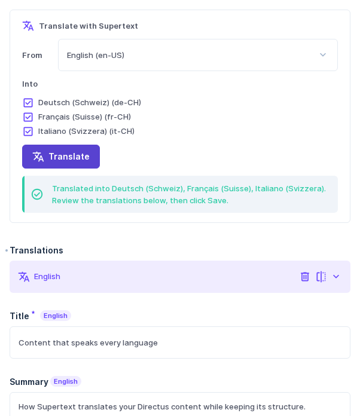

# Directus Supertext Translation

AI translation for [Directus](https://directus.io) 12 by [Supertext](https://www.supertext.com). Adds a **Translate with Supertext** box to the item form: pick the languages, click *Translate*, review the translations in Directus's own Translations field and save. A Flow operation translates in bulk or automatically.

- Works with Directus's standard translations (languages collection + Translations field)
- Text, rich text (formatting, links and structure kept, stays editable) and markdown
- Respects Directus permissions; nothing is saved until the editor clicks *Save*
- Flow operation for bulk and automatic translation
- A *Supertext* page for administrators with the configuration and a connection test

**Live demo:** <https://directus-production-349f.up.railway.app/admin> (credentials from the Supertext team)

## Requirements

Directus 12 and a Supertext API key. No Supertext account yet? [Create one at supertext.com](https://www.supertext.com/person/en/account/signin). Generate your API key at [supertext.com → Integrations → API](https://www.supertext.com/en/integrations/api) (requires the Admin role) and set it as `SUPERTEXT_API_KEY`. Details in the [Installation guide](docs/INSTALLATION.md#supertext-account-and-api-key).

## Guides

- [Installation guide](docs/INSTALLATION.md): requirements, install, API key, languages, permissions, Flows, settings, troubleshooting
- [User guide](docs/USER_GUIDE.md): translating, reviewing and saving in the Directus app
- [Developer guide](docs/DEVELOPER.md): architecture, Supertext API protocol, tests, demo, roadmap

Part of Supertext's translation plugins for open source CMSs. See also the [WordPress plugin](https://github.com/Supertext/supertext-wordpress-polylang), the [Drupal module](https://www.drupal.org/project/tmgmt_supertext_ai), the [Payload plugin](https://github.com/Supertext/Payload-Supertext-Translation) and the [Contao bundle](https://github.com/Supertext/Contao-Supertext-Translation).

[Changelog](CHANGELOG.md) · MIT licensed

<!-- supertext-plugins:start (shared list, keep identical in every Supertext plugin repo) -->
## Supertext plugins for other systems

Supertext offers AI and professional translation plugins for these systems:

| System | Plugin | What it does |
| --- | --- | --- |
| Adobe Experience Manager | [supertext-aem-connector](https://github.com/Supertext/supertext-aem-connector) | Translation connector for AEM 6.5's Translation Integration Framework |
| Contao | [Contao-Supertext-Translation](https://github.com/Supertext/Contao-Supertext-Translation) | *Translate with Supertext* in the site structure: pages or whole websites into other languages |
| Craft CMS | [CraftCms-Supertext-Translation](https://github.com/Supertext/CraftCms-Supertext-Translation) | Translates entries into your other sites, Matrix and rich text included |
| Directus | [Directus-Supertext-Translation](https://github.com/Supertext/Directus-Supertext-Translation) | *Translate with Supertext* box on the item form, fills the Translations field |
| django CMS | [djangoCMS-Supertext-Translation](https://github.com/Supertext/djangoCMS-Supertext-Translation) | Translates pages and their plugins from the toolbar |
| Drupal | [tmgmt_supertext_ai](https://www.drupal.org/project/tmgmt_supertext_ai) | Supertext AI provider for Drupal's Translation Management Tool (TMGMT), by MD Systems |
| Ghost | [Ghost-Supertext-Translation](https://github.com/Supertext/Ghost-Supertext-Translation) | Tag a post `#translate-…` and a translated draft appears |
| Grav | [Grav-Supertext-Translation](https://github.com/Supertext/Grav-Supertext-Translation) | Supertext panel in Grav 2's page editor, Markdown kept intact |
| Joomla | [Joomla-Supertext-Translation](https://github.com/Supertext/Joomla-Supertext-Translation) | Translates articles into linked, unpublished language versions |
| Neos | [Neos-Supertext-Translation](https://github.com/Supertext/Neos-Supertext-Translation) | Translates automatically when an editor creates a page in another language |
| Orchard Core | [OrchardCore-Supertext-Translation](https://github.com/Supertext/OrchardCore-Supertext-Translation) | Translates content items into other cultures, on demand or on localization |
| Payload CMS | [Payload-Supertext-Translation](https://github.com/Supertext/Payload-Supertext-Translation) | *Translate* button for localized collections and globals |
| Silverstripe | [Silverstripe-Supertext-Translation](https://github.com/Supertext/Silverstripe-Supertext-Translation) | Supertext tab translates pages and Elemental blocks into Fluent locales |
| Strapi | [Strapi-Supertext-Translation](https://github.com/Supertext/Strapi-Supertext-Translation) | Translates entries into other locales from the Content Manager |
| TYPO3 | [Typo3-Supertext-Translation](https://github.com/Supertext/Typo3-Supertext-Translation) | Translates pages and content elements as editors localize them |
| Umbraco | [Umbraco-Supertext-Translation](https://github.com/Supertext/Umbraco-Supertext-Translation) | *Translate with Supertext* for pages, block lists and grids included |
| Wagtail | [Wagtail-Supertext-Translation](https://github.com/Supertext/Wagtail-Supertext-Translation) | Machine translator for wagtail-localize |
| WordPress (Polylang) | [supertext-wordpress-polylang](https://github.com/Supertext/supertext-wordpress-polylang) | Supertext as Polylang Pro's machine-translation service, plus professional translation orders |
<!-- supertext-plugins:end -->
