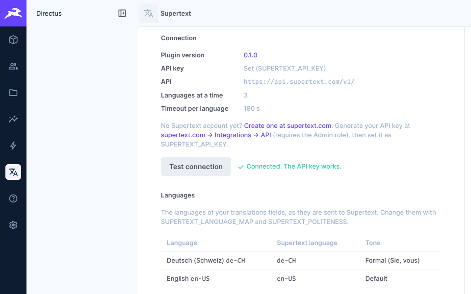
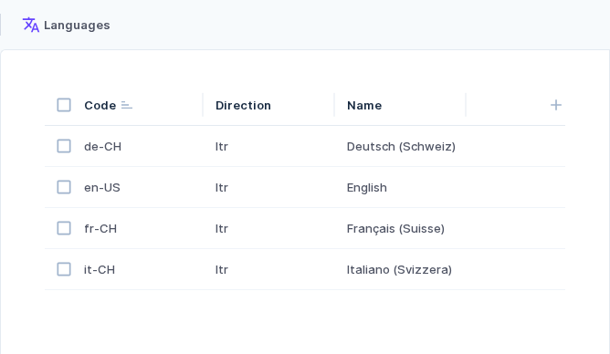
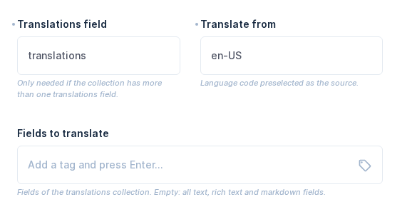
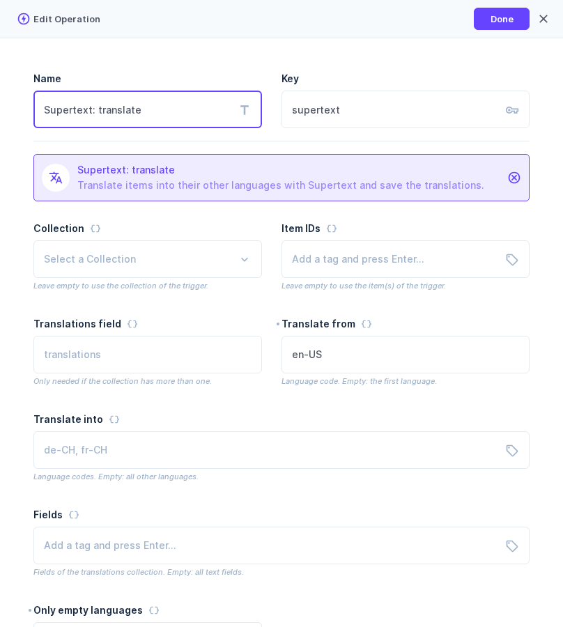

# Installation guide

For administrators who set up a Directus project. Editors: see the [User guide](USER_GUIDE.md).

## Requirements

| | |
| --- | --- |
| Directus | 12 (tested with 12.4) |
| Node.js | 22 or newer (as required by Directus 12) |
| Database | Any database Directus supports (tested with PostgreSQL and SQLite) |
| Multilingual content | Directus's standard setup: a languages collection and a **Translations** field on each collection to translate (see [Language setup](#language-setup)) |
| Supertext | A Supertext account and an API key with access to AI translation (see [Supertext account and API key](#supertext-account-and-api-key)) |

The Directus server must reach `https://api.supertext.com` over HTTPS.

## Install

The extension is a Directus *bundle* (an endpoint, an interface and a Flow operation). It runs on the Directus server, so it can't be sandboxed.

**From npm** (once published): in your Directus project, `npm install directus-extension-supertext-translation` and restart Directus. In the Marketplace (*Settings → Marketplace*), non-sandboxed extensions only show up with `MARKETPLACE_TRUST=all`.

**From this repository** (until it is on npm):

```bash
git clone https://github.com/Supertext/Directus-Supertext-Translation.git
cd Directus-Supertext-Translation
npm ci && npm run build
mkdir -p <your-project>/extensions/directus-extension-supertext-translation
cp -r package.json dist <your-project>/extensions/directus-extension-supertext-translation/
```

**Docker** (official `directus/directus` image): copy `package.json` and `dist/` to `/directus/extensions/directus-extension-supertext-translation/` in your image, as [demo/Dockerfile](../demo/Dockerfile) does.

Restart Directus. The log shows `Loaded extensions: … directus-extension-supertext-translation`.

## API key and settings

### Supertext account and API key

1. No Supertext account yet? Create one (or log in) at <https://www.supertext.com/person/en/account/signin>: enter your e-mail address and follow the link Supertext sends you.
2. Generate your API key at *supertext.com → Integrations → API*: <https://www.supertext.com/en/integrations/api>. This requires the **Admin** role in your Supertext account; otherwise ask a Supertext admin of your company.
3. Set the key as `SUPERTEXT_API_KEY` (below) and restart Directus. The Supertext page shows both links too, and *Test connection* checks the key.

### Settings

Settings are environment variables of the Directus server (`.env` or container variables). Never commit the key.

| Variable | Default | Description |
| --- | --- | --- |
| `SUPERTEXT_API_KEY` | — | Supertext API key. Pasting it with the `Supertext-Auth-Key ` prefix works too. Without a key the translate box says so and the button is disabled. |
| `SUPERTEXT_ENVIRONMENT` | `live` | `live`, `staging` or `testing` Supertext API. |
| `SUPERTEXT_API_URL` | — | Explicit API base URL (e.g. a proxy); overrides `SUPERTEXT_ENVIRONMENT`. |
| `SUPERTEXT_LANGUAGE_MAP` | `{}` | JSON: Directus language code → Supertext code, e.g. `{"de":"de-CH"}`. |
| `SUPERTEXT_POLITENESS` | `{}` | JSON: language → `more` (formal) or `less` (informal), e.g. `{"de-CH":"more"}`. |
| `SUPERTEXT_CONCURRENCY` | `3` | Languages translated at the same time. |
| `SUPERTEXT_POLL_INTERVAL` | `2` | Seconds between status checks while Supertext translates. |
| `SUPERTEXT_TIMEOUT` | `180` | Maximum seconds to wait for one language. |

JSON values can be written as they are, commas included (Directus would normally split a value at its commas; the extension reads these variables unsplit).

### The Supertext page

The bundle adds a **Supertext** page for administrators: the installed plugin version (linked to its release notes on GitHub), whether a key is set (with links to create a Supertext account and generate the key), which API is used, how many languages run at a time, the timeout, every language of your translations fields with the Supertext code and tone it is sent with, and a **Test connection** button (a cost-free call to the Supertext API that checks the key).

Directus hides new modules until they're switched on: *Settings → Settings → Module Bar*, enable **Supertext**. Only administrators see it.



## Language setup

The plugin uses Directus's own translations model. If your collections are already translated with a **Translations** field, there is nothing to change.

1. A **languages collection** (*Settings → Data Model*, usually `languages`) with the language code as primary key (`en-US`, `de-CH`, `fr-CH`, …) and a name.
2. On each collection to translate, a field of type **Translations** that points to it. Directus creates the `<collection>_translations` collection; the translatable fields (title, text, …) live there.
3. In the Translations field's options, set the *Default Language* to the language you write in. It is preselected as the source.



Codes are sent to Supertext as they are: the target keeps its region (`de-CH` stays `de-CH`), the source is sent as its primary subtag (`en-US` → `en`), because Supertext rejects regional source codes. Use `SUPERTEXT_LANGUAGE_MAP` for codes Supertext doesn't know.

## Add the translate box to a collection

1. *Settings → Data Model →* your collection → **Create Field** → **Supertext translation** (in the *Presentation* group).
2. Options (all optional):
   - **Translations field**: only needed if the collection has more than one translations field.
   - **Translate from**: the source language code to preselect (default: the Translations field's default language).
   - **Fields to translate**: fields of the translations collection; empty = all text, rich text and markdown fields.
3. Save and drag the field above the Translations field.



### What is translated

Fields of the `<collection>_translations` collection, chosen by their interface:

| Interface | Treatment |
| --- | --- |
| Input, Textarea (`input`, `input-multiline`) | Plain text |
| WYSIWYG (`input-rich-text-html`) | Rich text, block by block; formatting, links and structure kept |
| Markdown (`input-rich-text-md`) | Text of headings, paragraphs, list items, quotes and table cells; markdown syntax, links and code kept |

Not translated: slugs (inputs with the *slug* option), hidden and read-only fields, dropdowns, JSON, block editor, code, files and relations.

## Permissions

The plugin acts with the signed-in user's permissions:

- To translate, a user must be allowed to **update the item**, and to read the languages and translations collections.
- Saving the translations (the editor clicks *Save*) needs create/update permission on the translations collection, as for typing them by hand.
- Administrators can always translate.

No extra permission setting is needed. Users who may only read never spend translation credit: the request is refused before anything is sent to Supertext.

## Flows: automation and bulk translation

The bundle adds the Flow operation **Supertext: translate**. It translates and **saves**.



| Option | Description |
| --- | --- |
| Collection, Item IDs | Empty: taken from the trigger (event `key`/`keys`, manual trigger `keys`). |
| Translations field | Only needed if the collection has more than one. |
| Translate from | Source language code. Empty: the Translations field's default language. |
| Translate into | Language codes. Empty: all other languages. |
| Fields | Empty: all translatable fields. |
| Only empty languages | Skip languages that already have text. |

Examples:

- **Bulk from the item list:** Flow with a *Manual* trigger on the collection (location: collection/both), then the operation. Select items in the list and run the flow from the sidebar.
- **Translate new items automatically:** *Event Hook* trigger, type *Action*, scope `items.create`, the collection; operation with *Only empty languages*. Saving from the operation does not trigger flows again, so there is no loop.

The flow runs with its own permissions (*Run with: All permissions*, or the triggering user). If a language fails, the operation still saves the others and then fails with the details (reject path, flow logs).

## Update

npm: `npm update directus-extension-supertext-translation`; from the repository: pull, `npm ci && npm run build`, copy `dist/` again. Restart Directus. See [CHANGELOG.md](../CHANGELOG.md).

## Uninstall

Delete the *Supertext translation* fields from your collections and any flows using the operation, remove *Supertext* from the module bar, then remove the extension folder (or `npm uninstall`) and restart. Translations stay as they are; the plugin keeps no data of its own.

## Troubleshooting

| Symptom | Cause / fix |
| --- | --- |
| No *Supertext translation* interface when creating a field | The extension isn't loaded: check the Directus log for `Loaded extensions` / `Couldn't register bundle`, and that `dist/` was copied. |
| "No Supertext API key is configured" | Set `SUPERTEXT_API_KEY` and restart Directus. No key yet: see [Supertext account and API key](#supertext-account-and-api-key). *Test connection* on the Supertext page checks it. |
| No *Supertext* page in the module bar | Enable it under *Settings → Settings → Module Bar* (administrators only). |
| A JSON setting has no effect | Check it on the Supertext page (language table). The value must be a JSON object, e.g. `{"de-CH":"more","fr-CH":"more"}`. |
| "Save the item first, then translate it" | New items need to be saved once. |
| "There is no en-US text to translate" | The source language has no saved text; fill in and save it, or pick another source. |
| "You are not allowed to edit this item." | The user lacks update permission on the item (see [Permissions](#permissions)). |
| "Authentication failure" | Wrong key, or a key for another environment (`live` vs `staging`). Generate a new one at <https://www.supertext.com/en/integrations/api> (Admin role required). |
| "Too many requests to Supertext" | Rate limit; requests are retried automatically. Lower `SUPERTEXT_CONCURRENCY` if it persists. |
| "Your Supertext translation limit is exceeded" | The Supertext subscription quota is used up. |
| `INVALID_LANGUAGE_PAIR` in the error | A language code Supertext doesn't know; add a `SUPERTEXT_LANGUAGE_MAP` entry. |
| "Timed out waiting…" | Very long content or slow service: raise `SUPERTEXT_TIMEOUT`. |
| Rich text opens read-only after saving ("formatting the new editor doesn't support") | The **source** HTML already wasn't in the editor's form (e.g. imported content). Open the source field once, let Directus convert it, save, and translate again. |

Errors are also written to the Directus log (`[supertext] …`).
