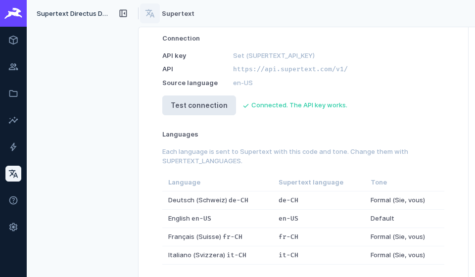
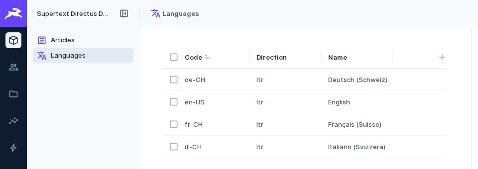
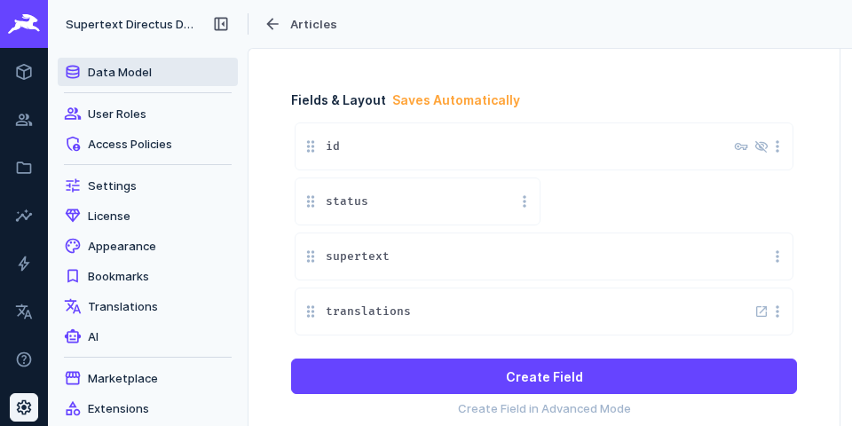

# Installation guide — Supertext Translation for Directus

For administrators who install and set up the extension. Editors find their part in the [user guide](USER_GUIDE.md).

## Requirements

- Directus 11 or 12 (self-hosted: Docker, npm or any other setup that loads extensions from the extensions folder)
- A collection with Directus' **Translations** field: the collection, a junction collection with the translated fields (e.g. `articles_translations`) and a languages collection (usually `languages`, with the language code as primary key)
- A Supertext account with an API key (Supertext → Account → API)
- The server must reach `https://api.supertext.com` over HTTPS

The extension is a *bundle* with three parts: an API endpoint (`/supertext`), the *Supertext Translation* interface and the *Supertext* module for administrators.

## Install

The extension is distributed as a package file `directus-extension-supertext-translation-<version>.tgz` (attached to every [GitHub release](https://github.com/Supertext/Directus-Supertext-Translation/releases)). To build it yourself:

```bash
git clone https://github.com/Supertext/Directus-Supertext-Translation.git
cd Directus-Supertext-Translation
npm ci && npm run build && npm pack
```

Unpack it into a folder of its own in Directus' extensions folder (`EXTENSIONS_PATH`, default `./extensions`):

```bash
mkdir -p extensions/directus-extension-supertext-translation
tar -xzf directus-extension-supertext-translation-0.1.0.tgz --strip-components=1 \
  -C extensions/directus-extension-supertext-translation
```

The folder must contain `package.json` and `dist/`. Nothing needs to be installed with npm: all dependencies are bundled. Restart Directus. The log shows `Loaded extensions: … directus-extension-supertext-translation`.

**Docker:** copy the unpacked folder into the image:

```dockerfile
FROM directus/directus:12
COPY --chown=node:node directus-extension-supertext-translation /directus/extensions/directus-extension-supertext-translation
```

or mount it as a volume at the same path.

### Update

Replace the folder's contents with the new version and restart Directus. Your settings (environment variables) and fields stay.

### Uninstall

1. Delete the *Supertext Translation* fields from your collections (Settings → Data Model → collection → field → *Delete Field*). They store no data.
2. Remove the *Supertext* module from the module bar (Settings → Settings → *Module Bar*).
3. Delete the folder `extensions/directus-extension-supertext-translation` and restart Directus.

Translations created with Supertext are ordinary translation rows and stay.

## API key

Set the key as an environment variable of the Directus server:

```bash
SUPERTEXT_API_KEY=your-key
```

You can paste it with or without the `Supertext-Auth-Key ` prefix that Supertext shows; the extension sends it as `Authorization: Supertext-Auth-Key <key>`. Keep the key in your hosting platform's secret variables, not in a file in your repository. Editors never see it.

To check it, open the **Supertext** module (see below) and click **Test connection**. This calls a cost-free endpoint of the Supertext API.



### Show the Supertext module

Directus only shows custom modules once they are switched on: **Settings → Settings → Module Bar**, enable **Supertext**. The module is visible to administrators only.

## Languages

The extension uses the languages of your **Translations** field: the rows of its languages collection. Each language code is sent to Supertext as the target language, so use BCP-47 codes such as `de-CH`, `fr-CH`, `it-CH`, `en-US`. Add or remove languages in **Content → Languages**.



If a code isn't one Supertext knows, or you want a different variant or tone, map it with `SUPERTEXT_LANGUAGES` (see below).

## Add the translate panel to a collection

1. **Settings → Data Model →** your collection (e.g. *Articles*) → **Create Field**.
2. Choose the interface **Supertext Translation** (group *Presentation*), give the field a key such as `supertext`, save.
3. Drag it where editors should see it, for example just above or below the Translations field.



The field stores nothing. It finds the collection's Translations field by itself (the first one, if there are several).

## Permissions

Translating runs with the editor's own permissions, exactly as if they edited the translations by hand. A role that should translate needs:

| Collection | Permission |
| --- | --- |
| The collection (e.g. `articles`) | Read |
| The junction collection (e.g. `articles_translations`) | Read, Create, Update (all fields that are translated) |
| The languages collection | Read |

The *Supertext* module and *Test connection* are for administrators only.

## Settings

All settings are environment variables of the Directus server (or entries in its `.env` file). Restart Directus after changing them.

| Variable | Default | Description |
| --- | --- | --- |
| `SUPERTEXT_API_KEY` | – | Your Supertext API key, with or without the `Supertext-Auth-Key ` prefix. Required. |
| `SUPERTEXT_ENVIRONMENT` | `live` | `live`, `staging` or `testing`: which Supertext API to use. |
| `SUPERTEXT_API_ENDPOINT` | – | A custom API base URL (overrides `SUPERTEXT_ENVIRONMENT`). |
| `SUPERTEXT_SOURCE_LANGUAGE` | – | Language editors translate from by default, e.g. `en-US`. Without it, the item's first existing translation is used. Editors can always choose another source language. |
| `SUPERTEXT_LANGUAGES` | – | JSON per Directus language code: `code` (the Supertext target language, if different) and `politeness` (`more` = formal, *Sie/vous*; `less` = informal, *du/tu*). Example: `{"de-CH":{"politeness":"more"},"fr":{"code":"fr-CH","politeness":"less"}}` |
| `SUPERTEXT_TIMEOUT` | `180` | Seconds to wait for one language's translation. |

The Supertext module shows the active values and, per language, the Supertext code and tone.

## Troubleshooting

| Symptom | Cause and fix |
| --- | --- |
| The interface *Supertext Translation* is missing when creating a field | The extension isn't loaded. Check the folder name and contents (`package.json` and `dist/`) and the Directus log after a restart. |
| The panel says *Supertext is not set up yet* | `SUPERTEXT_API_KEY` is not set on the server. Set it and restart Directus. |
| *The collection … has no Translations field* | The panel was added to a collection without a Translations field. Add one first (interface *Translations*). |
| *Authentication failed. Please check the Supertext API key.* | Wrong or revoked key. Check it in the Supertext account and use *Test connection*. |
| *You don't have permission to access this.* | The editor's role lacks one of the permissions listed above. |
| *Too many requests to Supertext* | The API's per-second limit was hit repeatedly although the extension retries. Try again in a moment. |
| *Timed out waiting for the Supertext translation* | Very long content. Raise `SUPERTEXT_TIMEOUT` (and your proxy's request timeout). |
| The Supertext module is missing from the module bar | Enable it under Settings → Settings → Module Bar (administrators only). |
| A language isn't translated or Supertext rejects it | Its code isn't a Supertext language. Map it with `SUPERTEXT_LANGUAGES`, e.g. `{"de":{"code":"de-DE"}}`. |

More technical details are in the [developer guide](DEVELOPER.md).
