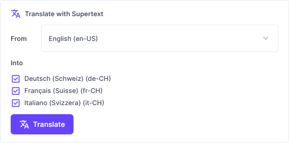
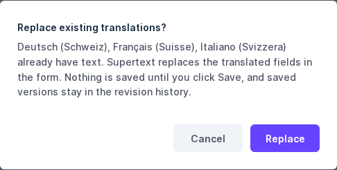
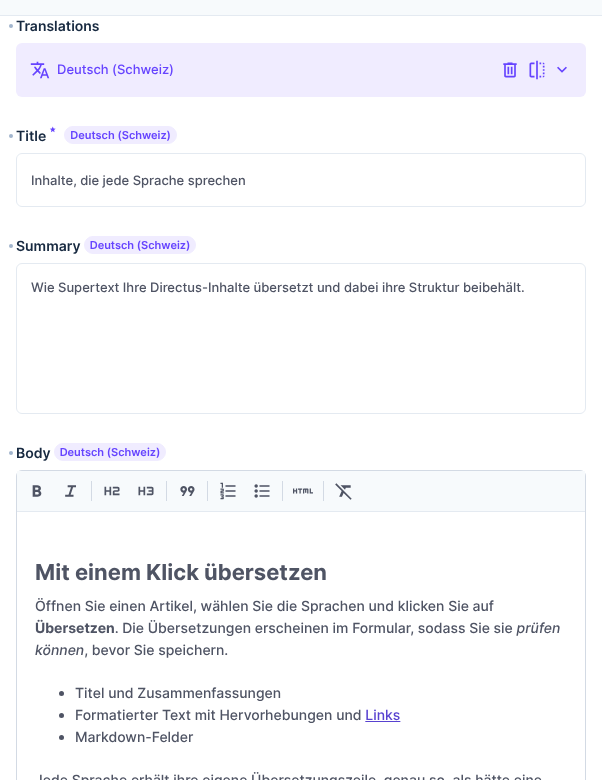

# User guide

For editors working in the Directus app. The Supertext box and its messages follow your Directus language (English, German, French or Italian; change it in your user profile under *Language*).

In Directus, each item has one **translation per language** in its *Translations* field. Supertext translates the text of one language into the others and fills them into the form. You review the result and save it, as if you had typed it.

## Translate an item

1. Open the item (e.g. *Content → Articles →* an article). It must have been saved at least once.
2. In the **Translate with Supertext** box:
   - **From**: the language you translate from (usually preselected).
   - **Into**: tick the languages to translate into. *has text — will be replaced* marks languages that already have a translation.

   

3. Click **Translate** and wait a few seconds per language.
4. If a selected language already has text, Directus asks before replacing it:

   

5. The box confirms which languages were translated. The *Translations* field now has unsaved changes (dot next to its label).

   

## Review and save

- Switch the language in the *Translations* field to check each translation. Edit anything you like.

  

- Click **Save** to store the translations. Until then nothing is changed; *Cancel* or leaving the page discards them.
- After saving, the previous version stays in the item's *Revisions*.

## What is translated

- Text fields of the translations (title, summary, …)
- Rich text (WYSIWYG): every paragraph, heading, list item, quote and table cell, with **bold**, *italic* and links kept in place
- Markdown: headings, paragraphs, list items, quotes and table cells; markdown syntax, links and code stay as they are

## What is not translated

- Slugs and other technical fields, dropdowns, dates, numbers
- Files and images, relations to other items
- Block editor and JSON fields
- Code blocks in rich text or markdown

## Things to know

- **Supertext translates the saved text.** If you changed the source language and didn't save, the box asks you to save first.
- **Translating again replaces** the translated fields of the selected languages. Make changes in the source language and translate again, or edit only after the last translation.
- Fields you fill by hand that Supertext doesn't translate (e.g. a slug) are kept.
- Your administrator may also translate automatically when items are created, or in bulk from the item list (a *Flow*). Those save directly.

## Messages

| Message | Meaning |
| --- | --- |
| *Translated into … Review the translations below, then click Save.* | Done; check and save. |
| *Save the item first, then translate it.* | New items must be saved once. |
| *The … text has unsaved changes.* | Save first: Supertext translates the saved text. |
| *There is no … text to translate.* | The source language is empty; choose another one or fill it in. |
| *Some text kept the source because Supertext returned it empty* | Check the named fields. |
| *No Supertext API key is configured.* | Ask your administrator (setup: [Supertext account and API key](INSTALLATION.md#supertext-account-and-api-key)). |
| *You are not allowed to edit this item.* | You can't translate items you can't edit. |
| *Authentication failure* / *limit is exceeded* | Supertext account problem; ask your administrator. |
| *Timed out waiting…* | Try again, or translate fewer languages at once. |

If you don't see the *Translate with Supertext* box, your administrator hasn't added it to this collection yet.
