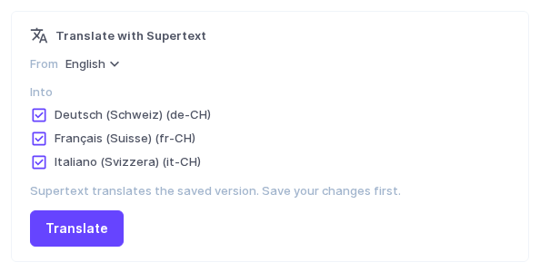
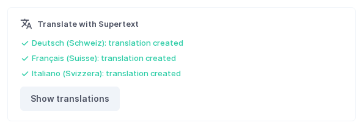
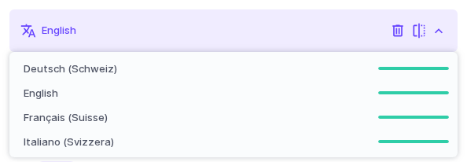
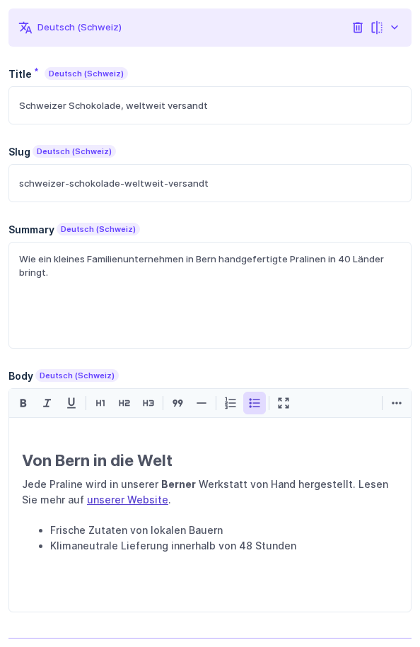
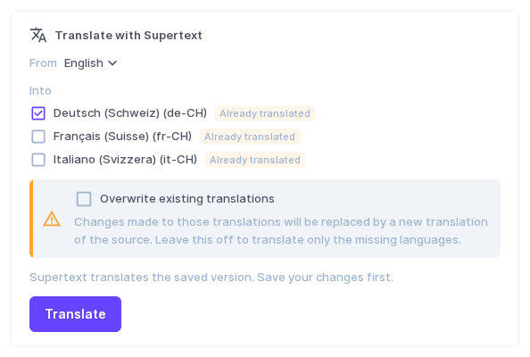

# User guide — Supertext Translation for Directus

For editors who translate content in the Directus Data Studio. Your administrator has installed the extension and added the *Translate with Supertext* panel to the collections you translate (see the [installation guide](INSTALLATION.md)).

## Translate an item

1. Open the item, for example an article under **Content → Articles**.
2. **Save** your changes first. Supertext translates the saved version.
3. In the **Translate with Supertext** panel:
   - **From**: the language you translate from (usually English). Only languages the item already has are offered.
   - **Into**: the languages to translate into. Languages without a translation are ticked for you.
4. Click **Translate**.

Each language takes a few seconds. The panel then lists what happened per language:

5. Click **Show translations** to reload the item with the new translations.

## Review the translation

The translations are saved straight away as normal translations of the item. Review them in the item's **Translations** field: choose the language in the language menu. The coloured bar next to each language shows how complete its translation is.

Change anything you like and **Save**, exactly as if you had translated by hand. Whether the translation is published depends on your item's status, not on Supertext.

## Translate again or update a translation

Languages that already have a translation are marked **Already translated** and are not ticked. If you tick one, the panel asks whether to overwrite it:

- Leave **Overwrite existing translations** off: those languages are skipped (*already translated, skipped*); only missing languages are translated. Your edits are safe.
- Turn it on: the translated fields of those languages are replaced with a new translation of the current source text. **Changes made to those translations are lost.** Use this after the source text has changed substantially.

## What is translated

The panel translates the fields of the item's **Translations** field (the fields that exist once per language):

| Field type | What happens |
| --- | --- |
| Text (input), multi-line text | Translated |
| Markdown | Translated as text; Markdown formatting usually comes back intact |
| WYSIWYG (rich text) | Translated as HTML: headings, bold, italic, links and lists stay in place, link addresses are kept |
| Slug (a field named `slug` or with the *Slug* option) | Translated as words, then turned back into a slug, e.g. `swiss-chocolate-shipped-worldwide` → `schweizer-schokolade-weltweit-versandt` |
| Dropdowns, radio buttons, colours, icons, code, hashes, true/false, dates | Not translated |
| Numbers, images, files, relations and other fields | Not translated. A **new** translation starts with the source's values; existing translations keep theirs. |

Fields of the item itself (outside the Translations field, e.g. *Status*) are never changed. Empty fields are skipped.

## Messages

| Message | Meaning |
| --- | --- |
| *Save the item first, then translate it.* | The item is new and not saved yet. |
| *Supertext is not set up yet: …* | No API key on the server. Ask your administrator. |
| *This item has no … version to translate from.* | The chosen source language has no translation in this item. Choose another *From* language. |
| *already translated, skipped* | The language has a translation and *Overwrite existing translations* was off. |
| *Authentication failed. Please check the Supertext API key.* | The server's API key is wrong. Ask your administrator. |
| *You don't have permission to access this.* | Your role may not edit these translations. Ask your administrator. |
| *Your Supertext translation limit is exceeded.* | Your organisation's Supertext limit is used up. |
| *Too many requests to Supertext. Please try again shortly.* | Supertext was busy; try again in a moment. |
| *Timed out waiting for the Supertext translation.* / *The Supertext service is currently unavailable.* | Supertext took too long or is unavailable. Try again later. Languages that succeeded are saved. |

Errors are shown per language: if one language fails, the others are still saved.
